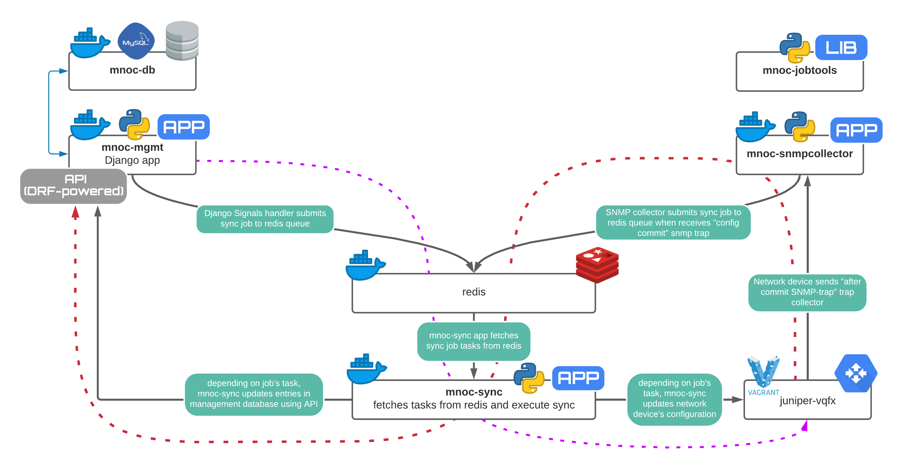

# MNOC
MNOC challenge app - sync vlans from DB to Device and Vice-versa with close to real-time consistency.

## Intro
The picture below describes the components of the project:


Here, we have the following components:
1. **mnoc-db** - docker container with Mysql database.  
2. **mnoc-mgmt** - docker container with Django application. Here (in service_directory app) 
    you can manage your devices and vlans. 
    It stores all the data in `mnoc-db`. When the data you change some vlan, 
    Signal handler sends the synchronization request (so called SyncJob) to the redis job queue.
    `mnoc-mgmt` has also RestApi, powered by `django rest framework`.
    API is used for interacting with other (micro-) services
3. **redis** - Just a simple redis kv-store. Here it is being used as a queue backend.
    All interactions with redis are done using library `mnoc_jobtools`
4. **juniper-vqfx** - This is VM which is run by Vagrant/Virtual box 
    (I didn't manage to find easy OS-agnostic way to run vqfx in container)
5. **mnoc-snmpcollector** - Docker container, that listens to UDP 162 and processes SNMP traps from device.
    As soon as trap has been received and recognized as Juniper Change-management trap - it submits SyncJob to redis.
    Important - SyncJobs are not scheduled for `automation` user commits.
6. **mnoc-sync** - This app in docker container constantly waits for a new SyncJob in Redis queue
    to start executing it. The only thing that the app needs to know - is synchronization direction: `DB->Device` or `Device->DB`. 
    That makes it capable to fully synchronize one storage to another at any time.
    We could basically run it scheduled, without any snmp/signal based hooks, but well, it's really easy, so let's better have some fun with real-time sync :)
7. **vqfx-ansible-provision** - just a helper, which configures the vQFX switch for you with initial stuff, like logins/snmp.

All containers are not persistent.

## Pre-requisites
I've tried to make this project as OS-agnostic and plug-and-play as possible, but still, 
networking world doesn't perfectly fit into the service oriented architecture.
So please, make sure that you have installed :
- `virtualbox`
- `vagrant`
- `docker`
- `docker-compose`
Here I use `vagrant` to orchestrate `virtualbox` vm and `docker-compose` to orchestrate `docker` containers.
Vagrant is the easiest way to deploy the virtualized switch and doesn't require transfer of juniper-eval-image 

## Spin-up the environment:
```shell script
git clone https://github.com/solry/mnoc && cd mnoc
cd vqfx-vagrant && vagrant up && export JUNOS_PORT=$(vagrant port --guest 22) && cd .. && sleep 20
dcoker-compose build
docker-compose up
```
If you have any issues with the environment setup, please let me know

## Having look around
[!all credentials are in the next section!]

Congratulations, you have your playground ready.
So, first - you have logs in docker-compose stdout.
Next, you can go to http://localhost:8000/admin/ and start creating vlans. You should see them at the device very soon
You can go to the device: `ssh human@localhost -p $(vagrant port --guest 22)` and create some vlans there (to see them in db soon)

## Possible issues
1. SNMP-traps are not being received by SNMPCollector:
Vagrant probably assigned another network to host. 
Connect to the vQFS and run `show system users` to see the private network address of the host.
Then config `set snmp trap-group public targets {}` with correct address at the device 


## All credentials

| Topic         | Key                    | Value  |
| ------------- | -------------------    | ----- |
| db            | name                   | mnoc-mgmt-db |
|               | user                   | db-user |
|               | password               | password |
|               | root-password          | db-password-root |
| django        | superuser name         | mnoc-mgmt-admin |
|               | superuser password     | mnoc-mgmt-password |
| snmp          | community string         | public |
| device        | community string         | public |
|               | root-password	| Juniper
|               | automation username |	automation
|               | automation password |	p@ssword
|               | human username |	human
|               | human password |	p@ssword

## What we can do better?
Well. Million of things. 
This is just unproductionized demo. Still, the software architecture allows to scale much further - 
for different network service and vendors.
- Security. Secrets management should be outside of the apps.
- WSGI-webserver. We should have separate container to run webserver and connect our Django app using WSGI (e.g. uWSGI, gunicorn)
- Cache server for Django web-app
- Event deduplication!!! Put events to one queue, dedup them and relay into the real job queue.
- SNMP trap listener - use threads to scale up
- mnoc-sync - now it is very specific app, but could be made more abstract to be able to sync any services.
- Consider some Job executor engine as Celery
